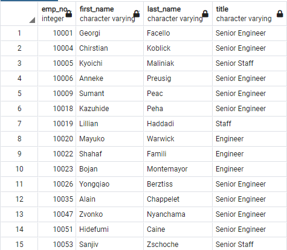

# Pewlett Hackard Analysis Challenge

## Project Overview
A database analysis was conducted for the company, Pewlett Hackard, to retrieve detailed information on employees who are projected to be retiring from the company. The analysis was prepared to understand how many employees will be retiring and how many new employees will need to be hired to replace them. A further requirement was requested to retrieve how many employees are eligible for the mentorship program.

The data used was performed on employees with birth dates ranging from the years 1952 through 1955. 

## Results

* The Entity Relationship Diagram (ERD) below is a diagram that helps illustrate how "entities" relate to each other within a system. The system for this analysis would be the the data sources provided by the company, the entities would be the columns within the documents and how they relate to the other columns within a different document.

For example, the employee number (emp_no) appears in many of the documents. The department number (dept_no) also appears in two documents. 

* The below table illustrates some of the employees (their name, employee number, title, and employment dates) that are retiring. This was the first anaylsis table ran to get an idea of how many employees are retiring and their titles.

### Future Job Openings
* The below table illustrates the amount of employees per department that are retiring and how many possible job openings would become available to fill.

### Mentorship Candidates
* The below table illustrates some of the employees that are eligible for the mentorship program and also displays their current title.

## Summary
* According to the retiring titles chart, 72,458 total employees are retiring from all the listed departments. According to the mentorship eligibility chart, 1,549 employees are eligible for the mentor program.
* After reviewing the analysis above, it does not look like there are enough employees in senior positions to mentor the new incoming employees if all of the roles that are open are being filled. 
