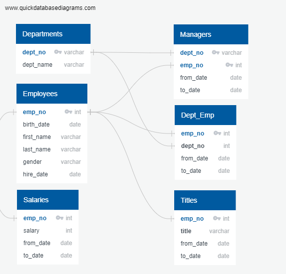
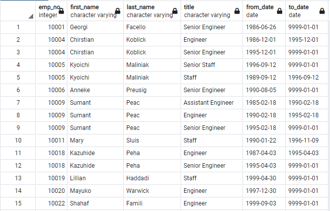
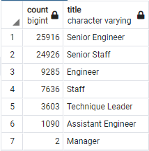
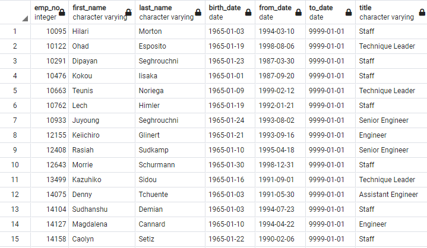

# Pewlett Hackard Analysis Challenge

## Project Overview
A database analysis was conducted for the company, Pewlett Hackard, for retrieve detailed information on employees who are soon retiring from the company. The analysis was prepared to understand how many employees will be retiring and how many new employees will need to be hired to replace them. A further requirement was requested that the data was filtered by current titles and only current employees.

The data used was performed on employees with birth dates ranging from the years 1952 through 1955. 

## Results

* The Entity Relationship Diagram (ERD) below is a diagram that helps illustrate how "entities" relate to each other within a system. They system would be the the data sources provided by the company, the entities would be the columns within the documents and how they relate to the other columns wwthin a different document.

For example, the employee number (emp_no) appears in many of the documents. The department number (dept_no) also appears in two documents. 

* The below table illustrates some of the employees (their name, employee number, title, and employment dates). This was the first anaylsis table ran to get an idea of how many employees are retiring.

### Future Job Openings
* The below table illustrates the amount of employees per department that are retiring and how many possible job openings would become available to fill.

### Mentorship Candidates
* The below table illustrates some of the employees that are eligible for the mentorship program and also displays their current title.

## Summary
